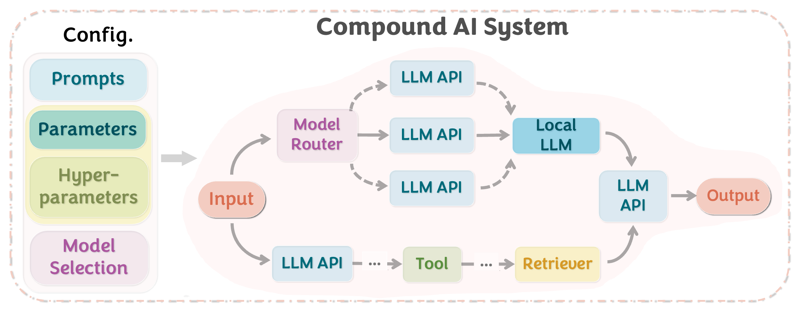

<div align="center">
<figure class="center-figure"> </figure>
</div>

<h1 align="left">
    Optimas: Optimizing Compound AI Systems with Globally Aligned Local Rewards
</h1>

<div align="left">

[](https://optimas.stanford.edu/)
[](https://arxiv.org/abs/2507.03041)
[](https://pypi.org/project/optimas-ai/)
[](https://optimas.stanford.edu/docs/getting-started/introduction)
[](https://opensource.org/licenses/MIT)
</div>

The repo is currently under preparation and we will release the full implementation as soon as possible!

## NEWS
- **[Jul 2025]** We release Optimas!

## What is Optimas?
Optimas is a unified framework for end-to-end optimization of compound AI systems. While traditional optimization methods focus on single configuration types—such as prompts or hyperparameters—modern compound AI systems require coordinated optimization across multiple heterogeneous configuration types that work well together.

Optimas addresses this fundamental challenge through its core innovation: **Globally Aligned Local Reward Functions (LRFs)** that align each component's optimization with global system performance. This enables efficient, decentralized optimization while ensuring that local improvements contribute meaningfully to global rewards, backed by formal theoretical guarantees.


🔥 Check out our [website](https://optimas.stanford.edu/) for more overview!

## 0. Set up API keys

```
export OPENAI_API_KEY=[YOUR KEY]
export ANTHROPIC_API_KEY=[YOUR KEY]
```

## 1. Generate Preference Data (used for reward model and optimization)


`python -m scripts.generate_reward_dataset scripts/configs/generate/{dataset}.yaml`

This runs reward data generation over a given dataset + system.
Output: HuggingFace-style reward dataset saved locally.

## 2. Train Initial Reward Model (Local Reward Functions)

`CUDA_VISIBLE_DEVICES=2,3,4,5 torchrun --master_port=56781 --nnodes=1 --nproc_per_node=4 -m scripts.train_reward_model scripts/configs/train/{dataset}.yaml`

where `nnodes` is the number of number of nodes, and `nproc_per_node` is the number of GPUs per node.

Trains a reward model using preference data. You need to include WANDB_ENTITY and WANDB_PROJECT in the `.env` file or export them in your shell:
```
export WANDB_ENTITY=your_wandb_entity
export WANDB_PROJECT=your_wandb_project
```

## 3. Run Optimization (Prompts, PPO LoRA, Hyperparameters)

`CUDA_VISIBLE_DEVICES=6 torchrun --master_port=56790 --nnodes=1 --nproc_per_node=1 -m scripts.optimize_system scripts/configs/optimize/{dataset}.yaml`

Uses Globally Aligned Local Reward Functions (LRFs) to optimize component variables.
Supports:
    - prompt tuning (opro, mipro, copro)
    - hyperparameter search
    - PPO for local models via LoRA (works with vLLM + OpenAI API)
Each component can be optimized independently or jointly.

Remember to include WANDB_ENTITY and WANDB_PROJECT in the `.env` file or export them in your shell.

## 🚀 Local Testing on Apple Silicon (M4 Mac Max)

For local development and testing, especially on Apple Silicon with ample RAM:

### Quick Local Setup
```bash
# Install with uv (recommended)
uv pip install -e ".[dev]"

# Test core functionality (no API keys needed)
python -c "from optimas.arch.system import CompoundAISystem; print('✅ Optimas ready!')"

# Run GEPA integration demo
python examples/universal_gepa_demo.py --quick-test
```

### Using Local Models with Ollama
```bash
# Install Ollama for local LLM inference
curl -fsSL https://ollama.ai/install.sh | sh

# Pull recommended models for M4 Mac Max (128GB RAM)
ollama pull llama3.1:8b      # Fast development (~5GB RAM)
ollama pull qwen2.5:14b      # Good quality (~9GB RAM) 
ollama pull llama3.1:70b     # Best quality (~80GB RAM)

# Configure for local use
export OPTIMAS_USE_LOCAL=true
export OLLAMA_BASE_URL="http://localhost:11434"
```

### Verification Tests
```bash
# Test original functionality is preserved
pytest tests/ -v

# Test GEPA integration doesn't break anything  
python -c "
from optimas.arch.base import BaseComponent
comp = BaseComponent('test', variable='prompt')
print('✅ Original methods:', hasattr(comp, 'forward'))
print('✅ GEPA methods:', hasattr(comp, 'gepa_optimizable_components'))
print('✅ Non-breaking integration verified!')
"
```

📖 **See [LOCAL_TESTING_GUIDE.md](LOCAL_TESTING_GUIDE.md) for comprehensive testing instructions and troubleshooting.**

## Advanced: Using GEPA with Custom Adapters and Logging

Optimas supports GEPA as a prompt optimizer, with deep integration for DSPy-based systems. For advanced users, you can:

- **Use a custom GEPAAdapter for non-DSPy systems:**
  - Implement the `GEPAAdapter` interface (see the [gepa documentation](https://github.com/gepa-ai/gepa) and `src/gepa/core/adapter.py`).
  - Pass your adapter instance to the GEPA optimizer logic in your pipeline (requires minor code changes to Optimas, or subclassing the optimizer to inject your adapter).
  - This allows you to optimize arbitrary text-based systems, not just DSPy modules.

- **Pass a custom logger or wandb config to GEPA:**
  - You can set `gepa_logger`, `gepa_wandb_api_key`, and `gepa_wandb_init_kwargs` in your OptimasArguments/config to control logging and experiment tracking.
  - Example YAML config snippet:
    ```yaml
    prompt_optimizer: gepa
    gepa_logger: my_custom_logger_instance  # (Python object, if using programmatic config)
    gepa_wandb_api_key: "your_wandb_api_key"
    gepa_wandb_init_kwargs:
      project: "my-gepa-project"
      entity: "my-wandb-entity"
    ```
  - These will be passed directly to the underlying GEPA engine.

- **Budgeting:**
  - You can control the optimization budget using `gepa_max_metric_calls` or `gepa_num_iters` (mutually exclusive).

For more details, see the [GEPA documentation](https://github.com/gepa-ai/gepa) and the DSPy [GEPAAdapter example](https://github.com/stanfordnlp/dspy/blob/main/dspy/teleprompt/gepa/gepa_utils.py).

## 4. Evaluate Final System

`python scripts/eval_system.py scripts/configs/eval/{dataset}.yaml`

Evaluates a saved system state dict on val/test sets.
Supports test repeat for randomized components.

## Component Types Supported

- Prompt templates (as strings)
- Model config (e.g., model name, temperature)
- Hyperparameters (grid search)
- Local LLM weights (LoRA + PPO finetuning)

Each component declares:
    - input_fields
    - output_fields
    - variable (what to optimize)
    - variable_search_space (optional)

## Adding Your Own System

1. Define your pipeline in examples/systems/<your_system>.py as `system_engine()`
2. Register it in examples/systems/__init__.py
3. Add your dataset to examples/datasets/

Example:
```python
    def system_engine():
        return CompoundAISystem(
            components={...},
            final_output_fields=[...],
            ground_fields=[...],
            eval_func=...
        )
```

## Reference

```
@article{optimas,
    title        = {Optimas: Optimizing Compound AI Systems with Globally Aligned Local Rewards},
    author       = {
        Shirley Wu and Parth Sarthi and Shiyu Zhao and
        Aaron Lee and Herumb Shandilya and
        Adrian Mladenic Grobelnik and Nurendra Choudhary and
        Eddie Huang and Karthik Subbian and 
        Linjun Zhang and Diyi Yang and
        James Zou and Jure Leskovec
    },
    year        = {2025},
    journal     = {arXiv preprint arXiv:2507.03041},
}
```
